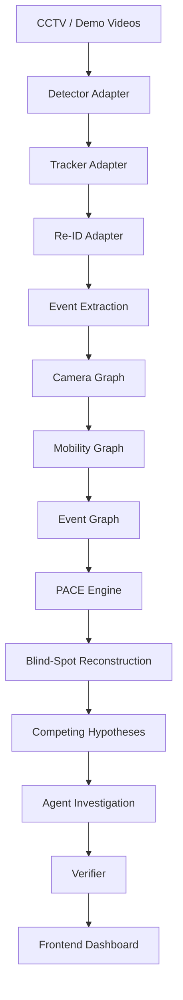

# ARGUS — Evidence-Aware Event Reconstruction

> "CCTV records fragments. ARGUS reconstructs the story — without hiding the gaps."

ARGUS is a multi-camera spatio-temporal reasoning system. It combines computer vision, temporal reasoning, camera topology, evidence provenance, physical constraints, and AI agents to reconstruct incidents from fragmented observations.

## Core Philosophy

ARGUS distinguishes between four epistemic states:

| State | Meaning | Visual |
|---|---|---|
| **OBSERVED** | Directly supported by camera-derived evidence | Cyan |
| **INFERRED** | Derived from observations + deterministic/probabilistic reasoning | Purple |
| **UNKNOWN** | Insufficient evidence to conclude | Gray |
| **REJECTED** | Hypothesis explicitly invalidated by PACE | Red |

**Non-negotiable rules:**
- ARGUS never presents inference as direct observation
- "LLMs propose. Deterministic systems verify."
- UNKNOWN is a valid, successful answer
- REJECTED hypotheses remain visible for explainability

### The Missing-Laptop Demo
A laptop goes missing from Desk 4. A person is OBSERVED approaching the desk (CAM_01). The laptop is OBSERVED missing afterward. The system INFERs a candidate trajectory to a corridor camera (CAM_02) across a 53-second blind spot.

### The Physically Impossible Re-ID Example
A visually similar person (91% appearance similarity) appears on a distant camera (CAM_04) only 16 seconds later. The distance is 140 metres (minimum 100 seconds travel). PACE deterministically flags this as **REJECTED** — physically impossible.

## Architecture



The architecture is **model-agnostic**. Candidate implementations:
- **Detector**: YOLO, RT-DETR (via `DetectorAdapter` protocol)
- **Tracker**: ByteTrack, BoT-SORT (via `TrackerAdapter` protocol)
- **Re-ID**: OSNet, YoutuReID (via `ReIdAdapter` protocol)

No specific model is chosen in the skeleton. Member 1 swaps implementations through adapters.

## Repository Structure & Ownership

| Directory | Owner | Status | Purpose |
|---|---|---|---|
| `vision/` | Member 1 | SCAFFOLDED | Adapter protocols defined, no model integration |
| `intelligence/` | Member 2 | PARTIAL | PACE travel-time implemented; graph interfaces defined |
| `agent/` | Member 3 | SCAFFOLDED | LLM/Investigator/Verifier interfaces defined |
| `services/api/` | Member 3 | MOCK WORKING | FastAPI with 10 route stubs serving mock data |
| `storage/`, `infra/` | Member 3 | SCAFFOLDED | Empty directories |
| `apps/web/` | Member 4 | MOCK WORKING | React dashboard with service layer |
| `packages/contracts/` | **Team** | IMPLEMENTED | Pydantic, TypeScript, JSON Schema |
| `mocks/` | **Team** | IMPLEMENTED | Golden demo fixtures |

## Current Implementation Status

| System | Status | What Exists | What Is Missing |
|---|---|---|---|
| Contracts | IMPLEMENTED | 12 Pydantic models, TS interfaces, JSON Schemas | — |
| Vision | SCAFFOLDED | `DetectorAdapter`, `TrackerAdapter`, `ReIdAdapter` protocols + mocks | Real model integration |
| PACE | PARTIAL | `check_travel_time` (tested), stubs for 5 other checks | Reachability, direction, contradiction logic |
| Intelligence | SCAFFOLDED | Typed interfaces for all graphs | Graph algorithms |
| Agent | SCAFFOLDED | `LLMClient`, `Investigator`, `Verifier` interfaces + `FakeLLMClient` | Bedrock integration, tool loop |
| Backend | MOCK WORKING | 10 API routes, typed errors, OpenAPI tags | Real DB queries |
| Frontend | MOCK WORKING | Service layer, typed components, epistemic styling | Video player, graph viz |
| AWS | SCAFFOLDED | Empty CDK directory | All resources |

## How to Run (Windows PowerShell)

**Prerequisites**: Python 3.12+, Node.js 18+

```powershell
# 1. Check environment health
.\scripts\doctor.ps1

# 2. Setup (venv, pip, npm, seed mock data)
.\scripts\setup.ps1

# 3. Validate (pytest + frontend build + hygiene)
.\scripts\validate.ps1

# 4. Run Mock Demo (FastAPI :8000 + React :5173)
.\scripts\run_mock_demo.ps1
```

## Mock Mode

| Mock File | Contents |
|---|---|
| `mocks/cameras/cameras.json` | 4 cameras (Library, Corridor, Exit, South Annex) |
| `mocks/events/events.json` | 3 events (approach, disappearance, reappearance) |
| `mocks/transitions/transitions.json` | 3 camera transitions with travel-time stats |
| `mocks/hypotheses/hypotheses.json` | 1 plausible + 1 REJECTED hypothesis |
| `mocks/hypotheses/reid_candidates.json` | 1 plausible + 1 impossible Re-ID candidate |
| `mocks/investigations/inv_001.json` | Complete investigation response |

All modules respect `ARGUS_USE_MOCKS=true`. No AWS, GPU, or API keys required.

## What Is NOT Implemented

- Real video ingestion / RTSP streaming
- Object detection, tracking, appearance embedding inference
- Graph pathfinding / learning algorithms
- Amazon Bedrock LLM interaction
- DynamoDB / S3 / any AWS deployment
- Production authentication

## Integration Order

Contracts → Mock E2E → Vision → Intelligence → Agent → Frontend Integration → AWS

Development happens **in parallel** using mocks.

## Important Shared Files

These require **team approval** before modification:
- `packages/contracts/python/argus_contracts/*.py`
- `packages/contracts/typescript/index.ts`
- `mocks/investigations/inv_001.json`

## Architectural Guardrails (Non-Negotiable)

1. LLM is never the source of physical evidence
2. PACE remains deterministic — no probabilistic overrides
3. Inference is never displayed as direct observation
4. Vision implementations are replaceable through adapter protocols
5. Core domain logic is testable without cloud access
6. Mock mode must remain operational throughout development
